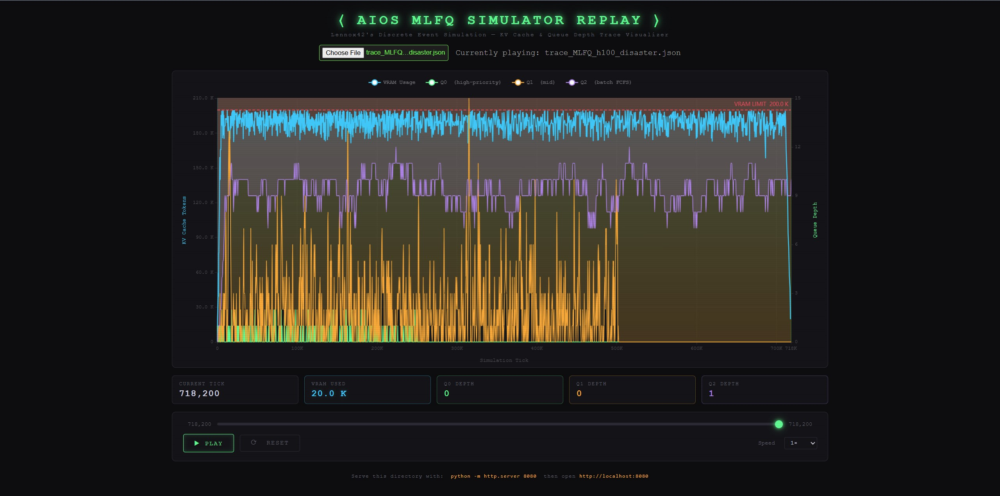

# ⚡ AI-MLFQ: Memory-Aware LLM Scheduler

*A discrete-event simulator proving that OS-level MLFQ scheduling can obliterate LLM tail latency in multi-agent environments.*

## 📊 The Benchmark (H100 Disaster Simulation)

*(Above: A Trace-Based replay of the disaster benchmark. Notice the blue VRAM footprint constantly thrashing against the 200K limit, while MLFQ ruthlessly preempts purple heavy batches to clear the way for green interactive tasks.)*

We simulated a system at the "Edge of Chaos" under a true Poisson arrival process ($\lambda = 0.02$). The workload consists of 5,000 concurrent agents (85% short interactive chats, 15% massive 30k-token RAG batches) hitting a strictly constrained 200k-token VRAM budget.

By aggressively preempting heavy tasks and simulating realistic PCIe 4.0/5.0 Page-Out penalties, Interactive P99 Time-to-First-Token (TTFT) dropped to near-zero (-100%), with zero loss to overall system throughput. More importantly, under realistic Poisson traffic, the interactive generation fluency (TBT) remained imperceptible to humans.

~~~text
════════════════════════════════════════════════════════════════════════
  METRIC                                          FIFO          MLFQ
════════════════════════════════════════════════════════════════════════
  Total Ticks to Drain                          718323        718323
────────────────────────────────────────────────────────────────────────
  INTERACTIVE TASKS (prefill 100-500, decode 10-50)  
    Count                                         4250          4250
    Avg Turnaround Time                     228961.74t        99.73t  (-100.0%)
    P99 First-Response Latency (TTFT)       462352.00t        16.00t  (-100.0%)
    Avg Time Between Tokens (TBT)                1.00t         3.89t  (+288.6%)
────────────────────────────────────────────────────────────────────────
  HEAVY BATCH TASKS (prefill 10k-30k, decode 500-1000)
    Count                                          750           750
    Avg Turnaround Time                     233434.80t    350837.15t  (+50.3%)
    P99 First-Response Latency (TTFT)       461569.00t       415.00t  (-99.9%)
    Avg Time Between Tokens (TBT)                1.00t       492.37t  (+49136%)
════════════════════════════════════════════════════════════════════════
~~~

## 🧠 Motivation
In concurrent multi-agent environments, treating an LLM API call as an indivisible, blocking request leads to catastrophic **Head-of-Line (HoL) blocking**. When compute-heavy background tasks monopolize the inference engine, latency-sensitive interactive agents suffer from severe P99 tail latency spikes. Standard HTTP-level FIFO dispatchers fail entirely at isolating these bimodal workloads.

## 🏗️ Architecture & Feasibility
AI-MLFQ brings OS-level CPU scheduling primitives to LLM resource management. Assuming modern inference backends (e.g., vLLM) that support *Continuous Batching* and *Paged KV Cache*, we abstract a single LLM forward pass (generating "one" token) as an atomic compute quantum.

* Chunked Prefill & Decode: Tasks are processed in distinct phases. A single atomic tick computes either a chunk of 512 Prefill tokens or 1 Autoregressive Decode token.
* Preemption: Long-running generation tasks are preempted once they exhaust their high-priority time quantum.
* Memory-Aware Eviction: LLM context switching requires massive PCIe transfers (HBM ↔ Host DRAM). Our simulator actively tracks active KV Cache tokens and enforces PCIe I/O penalties when VRAM bounds are breached.
* Compute-I/O Overlap: While evicted tasks serve their PCIe penalty, the GPU's Streaming Multiprocessors (SMs) immediately execute the next Q0 task, keeping utilization at 100%.

> **📖 Deep Dive:** For a rigorous breakdown of how our variables map to real-world hardware (Tick duration, H100 VRAM limits, and PCIe bandwidth maths), read the [DESIGN.md](DESIGN.md).

**👁️ Trace-Based WebUI Visualizer**
To truly understand the VRAM thrashing dynamics, the simulator outputs a downsampled `trace.json` file. Serve the `web/` directory to launch a dark-mode ECharts dashboard. It provides a scrubber to replay the exact moments of VRAM saturation, showing Stacked Area Charts of Queue Depths and KV Cache footprints.

## 🛠️ Usage
To run the simulator and generate the benchmark report yourself:

~~~bash
go run main.go
cd web && python3 -m http.server 8080
~~~
